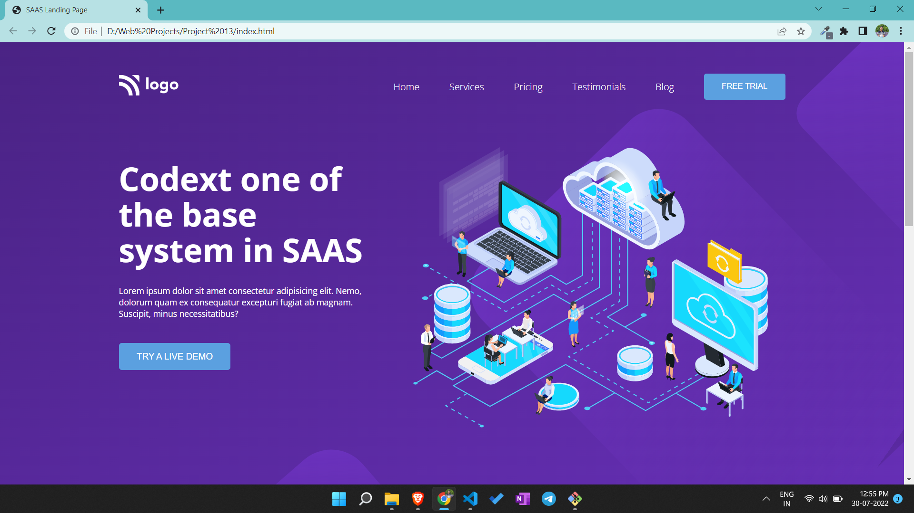

# Portfolio project 13

This is a one page portfolio template project made in HTML and CSS.

# Project live link

[Portfolio-project-13](https://melodious-douhua-08e917.netlify.app)

# Screenshot

# My learnings from this projects

- I learned to make layouts using flex box.
- I learned about adding svg images in this project.
- I learned to make reusable cards.

# Time to finish the projecet

I took about 5 hours approximately to complete this project.
